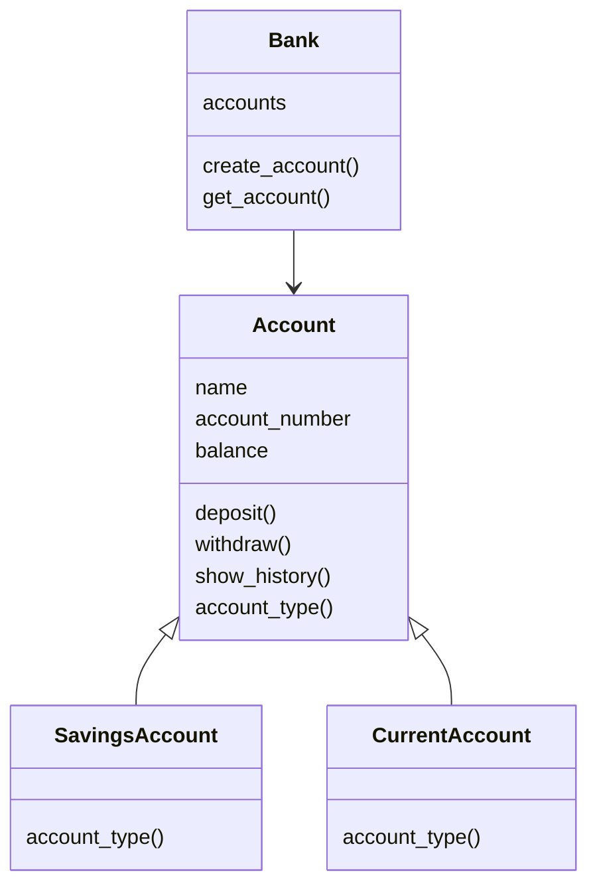

```mermaid
classDiagram
    class Account {
        name
        account_number
        balance
        deposit()
        withdraw()
        show_history()
        account_type()
    }

    class SavingsAccount {
        account_type()
    }

    class CurrentAccount {
        account_type()
    }

    class Bank {
        accounts
        create_account()
        get_account()
    }

    Account <|-- SavingsAccount
    Account <|-- CurrentAccount
    Bank --> Account
```